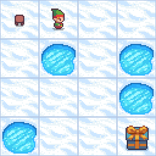
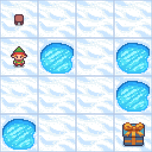

# 🧠 AI Assignment 2: Search and Optimization

[](https://www.python.org/)
[](https://www.gymlibrary.dev/)
[](LICENSE)
[](https://github.com/Ashantfet/AI_Optimation_search)

> **Course**: Artificial Intelligence  
> **Student**: Ashant Kumar (CS24M113)  
> **Institute**: IIT Tirupati  
> **Submission Date**: April 6, 2025

---

## 📌 Overview

This repository contains implementations and performance evaluations of classical **Search and Optimization Algorithms** applied to two different environments as part of AI Assignment 2.

### 🔍 Implemented Algorithms
- **Branch and Bound (BnB)**
- **Iterative Deepening A\***
- **Hill Climbing (HC)**
- **Simulated Annealing (SA)**

---

## 🧪 Problem Setup

### Environments
- ❄️ **Frozen Lake (OpenAI Gym)**  
  Used for **BnB** and **IDA\***
- 🔹 **Traveling Salesman Problem (TSP)** via `gym_TSP`  
  Used for **HC** and **SA**

### Heuristics
- **Frozen Lake**: Manhattan Distance to goal
- **TSP**: Total path cost from permutation of cities

---

## 📊 Evaluation Metrics
Each algorithm is tested on:
- **Average Time to Goal / Optimum**  
- **Reward** = `-1 × Distance or Steps`
- **Convergence Point** (number of iterations)

All experiments were run for 5 trials. A timeout `τ = 10 minutes` was used to terminate long executions.

---

## 🔎 Results

### ✅ Branch and Bound vs IDA\* (on Frozen Lake)





**Observations**:
- **BnB**: Slightly higher average time due to outlier run, memory-intensive.
- **IDA\***: Faster and more consistent; uses less memory.

---

### 🛍 Hill Climbing vs Simulated Annealing (on TSP)


**Observations**:
- **Hill Climbing**: Fast but often stuck in local minima. Restarts cost time.
- **Simulated Annealing**: Slower but more exploratory, avoids premature convergence.

---

## ⚖️ Algorithm Comparison

> 🎯 **Takeaway**:  
> - Algorithm choice depends on problem complexity.  
> - Trade-off between **solution quality** and **computation time**.  
> - Heuristics deeply affect outcomes.

---

## ⚙️ Requirements

Create a virtual environment and install dependencies:

```bash
python -m venv venv
source venv/bin/activate  # On Windows: venv\Scripts\activate

pip install -r requirements.txt
```

### `requirements.txt`

```
gym
matplotlib
numpy
tqdm
imageio
```

---

## 📂 Folder Structure

```
AI_Optimation_search/
│
├── FrozenLake/
│   ├── bnb_frozenlake.py
│   ├── ida_star_frozenlake.py
│   └── gifs/
│       ├── bnb_frozenlake.gif
│       └── ida_frozenlake.gif
│
├── TSP/
│   ├── hc_tsp.py
│   ├── sa_tsp.py
│   ├── gym_TSP/        # Git submodule
│   └── gifs/
│       ├── hc_tsp.gif
│       └── sa_tsp.gif
│
├── results/
│   └── metrics_plots.ipynb
├── requirements.txt
└── README.md
```

---

## 🔗 GitHub Repository

[👉 Click to Visit Repository](https://github.com/Ashantfet/AI_Optimation_search)

---

## 🙏 Acknowledgements
- OpenAI Gym for Frozen Lake environment  
- `gym_TSP` library for solving TSP  
- Special thanks to the AI course instructors and peers for guidance

---

## 📧 Contact
Ashant Kumar – *cs24m113@iittp.ac.in*

